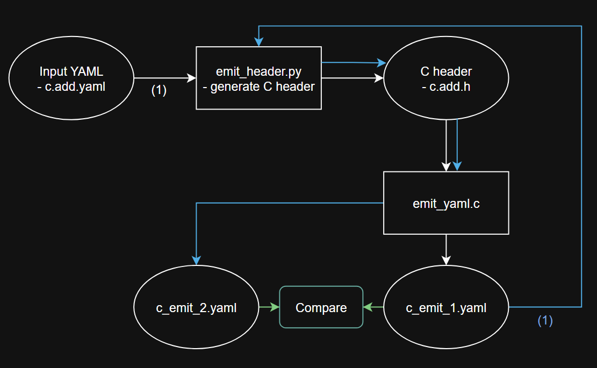

# RISCV-UDB-Challenge

This repository contains the files required for the coding challenge for the project "Code Gen: From UDB to Implementations". 
- The solution has been tested using the file `c.add.yaml` in `spec/std/isa/inst/C/` in riscv-unified-db.

The data flow diagram is as follows:

- In the first round (white arrows) the input YAML is used to generate `c.add.h`. The C program then uses the header to generate `c_emit_1.yaml`.
- In the second round (blue arrows) the input YAML is `c_emit_1.yaml`. It is used to generate the updated  header `c.add.h`. The C program then uses the header to generate `c_emit_2.yaml`.
- Finally, `c_emit_1.yaml` and `c_emit_2.yaml` are compared (green arrows).



## Usage

The following commands should be used in order to compare the emitted YAML files.

See `example_output/` for the outputs from the test run.

```sh
python emit_header.py c.add.yaml # generate header

gcc emit_yaml.c -o emit_yaml # compile C program

./emit_yaml.exe c_emit_1.yaml # or ./emit_yaml.out

python emit_header.py c_emit_1.yaml # generate header

./emit_yaml.exe c_emit_2.yaml # or ./emit_yaml.out

# compare the YAML outputs
if cmp --silent -- c_emit_1.yaml c_emit_2.yaml; then
  echo "File contents are identical"
else
  echo "Files differ"
fi
```

## Code Explanations

### Python Script

The python script `emit_header.py` is used to generate the C header file from an input YAML file. It uses the library `PyYAML` to load the contents from the YAML file. It declares a class `c_header_gen` to:
- store the header data state
- parse variables for the header
- safely convert YAML strings to C strings
- emit the header file

### C Header Format

The header file defines a variable of the type `inst_t` for the given instruction, populated with the data from the input YAML. The header file includes `inst_types.h` which defines the fields in `inst_t`.

```c
typedef struct {
    const char* schema_version;
    const char* kind;
    const char* name;
    const char* long_name;
    const char* description;
    inst_defined_by_t defined_by;
    const char* assembly;
    inst_encoding_t encoding;
    access_t access;
    int data_independent_timing;
    const char* operation;
    const char* sail;
} inst_t;
```

### C Program for YAML Generation

The C program uses the generated header to emit the generated YAML file. It defines a function `emit_yaml()` which follows a consistent format and order for the YAML fields.